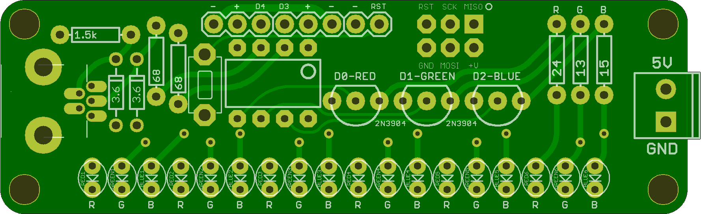
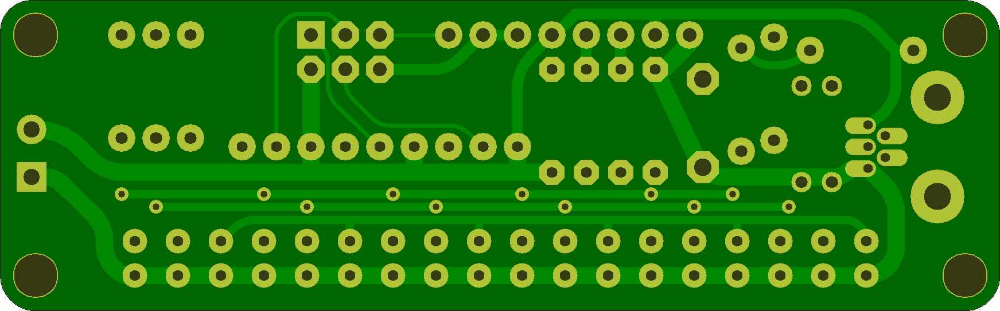

## LED Color Bar

This is intended to be used to light up a glass sculpture or etching on glass or plexiglass. 

The usb level shifting components would theoretically allow you to control the colors over the USB port, but I haven't goten around to trying that yet. 

The small oval LED's are CREE 4mm ovals 
## ColorBar 

### Board dimensions

* (290000, 90000) original units
* (2.9000, 0.9000) inches
* (73.6600, 22.8600) mm

| Front | Back |
| --- | --- |
|  |  |

